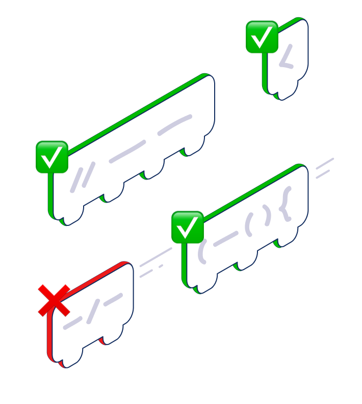

<p align="center">
<br/>
<br/>
   
<br/>
<br/>
</p>
<p align="center">
<hr/>
</p>

<p align="center">


</p>

# Service Policy Kit

`service_policy_kit` is a Rust based toolkit for verifying HTTP services against policies. You can:

* Build a complete testing framework on your own, with `service_policy_kit` taking care of all the expectation logic
* Run fuzzing tests against your services
* Integrate in your code to perform custom readiness/self checks
* Build your own tools (CLIs) that perform service validation and security testing of different kinds

## Quick Start

Add to `Cargo.toml`


```ini
service_policy_kit = "0.2.0"
```

## Example

Here's a full-blown policy runner that you can reuse:

```rust
use serde_yaml;
use service_policy_kit::data::{Context, SequenceInteractions};
use service_policy_kit::runner::{RunOptions, SequenceRunner};
use std::process::exit;

fn main() {
    let opts = RunOptions::default();
    let runner = SequenceRunner::from_opts(&opts);

    let sequence: SequenceInteractions = serde_yaml::from_str(
        r#"
http_interactions:
- request:
    id: step one
    uri: http://example.com
  response:
    status_code: "200"
"#,
    )
    .unwrap();
    let mut context = Context::new();
    let res = runner.run(&mut context, &sequence.http_interactions);
    exit(if res.ok { 0 } else { 1 })
}
```

You can run it by cloning this repo, and then:

```
cargo run --example quick-start
```

You should get:

```yaml
$ cargo run --examples quick-start

✔ step one: ok 288ms

Ran 1 interactions with 1 checks in 288ms

Success: 1
Failure: 0
  Error: 0
Skipped: 0
```


## Capabilities

* :white_check_mark: &nbsp;Flexible design: Use the runner for any purpose, sequence or individual interactions
* :white_check_mark: &nbsp;Contextual flows: interactions can extract, define and pass variables to the next ones
* :white_check_mark: &nbsp;Out of the box reporters: saves you some boilerplate work
Multiple checks included: content, benchmark, certificates
* :white_check_mark: &nbsp;Discovery (WIP): given recorded API interactions, or an API spec, automatically generate interactions.


## Concepts

There are a few concepts that make up `service_policy_kit`: `Interaction`, `Expectation`, `Check`, `Violation` and `Runners`.

### Interaction

An interaction is a definition of calling an external service, and the expected responses per check type.

```rust
Interaction {
   request,
   response,
   examples,
   benchmark,
   cert,
}
```

### Expectation (Policy)

An expectation is a set of expected matchers for all of the parts that are extracted from an interaction response.


Each of the fields take regular expressions and are matched against a live response accordingly.

```rust
Response {
   headers,
   status_code,
   body,
   vars,
}
```


### Check

A check is an abstract action over a response. For example, running content expectation, a benchmark, or any other policy against a service.


### Violation

Any check can output violation. A successful check has no violations.
### Runners

A runner takes a set of _interactions_ and execute these. For example, the included `SequenceRunner` will always execute interactions in a sequence, extracting variables from one interaction and passing it to the next one via `Context`.

# Thanks

To all [Contributors](https://github.com/spectralops/service-policy-kit/graphs/contributors) - you make this happen, thanks!


# Copyright

Copyright (c) 2021 [@jondot](http://twitter.com/jondot). See [LICENSE](LICENSE.txt) for further details.


